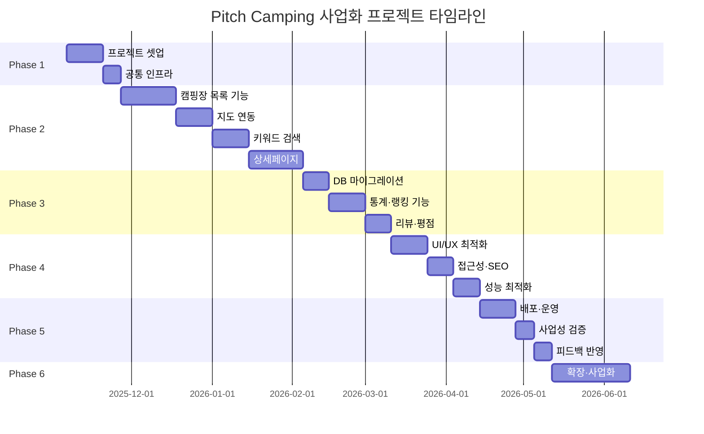
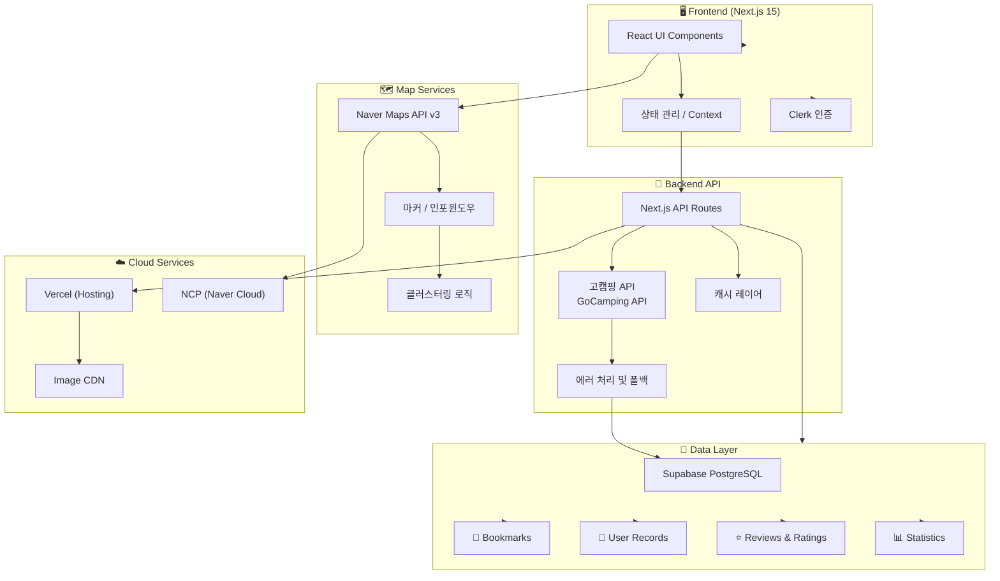
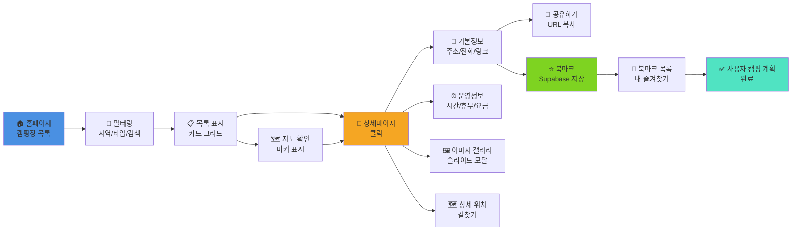
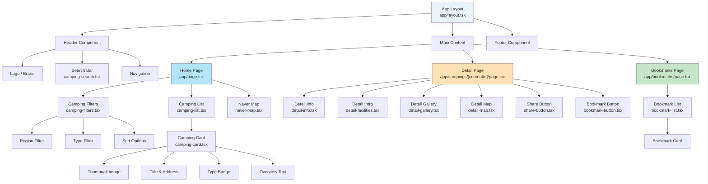
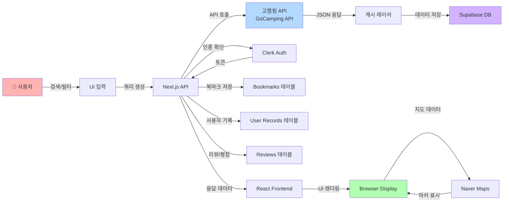
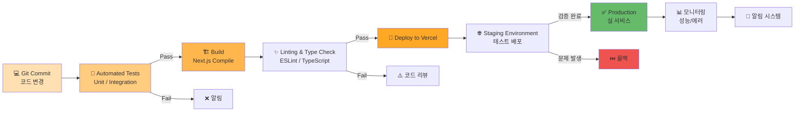
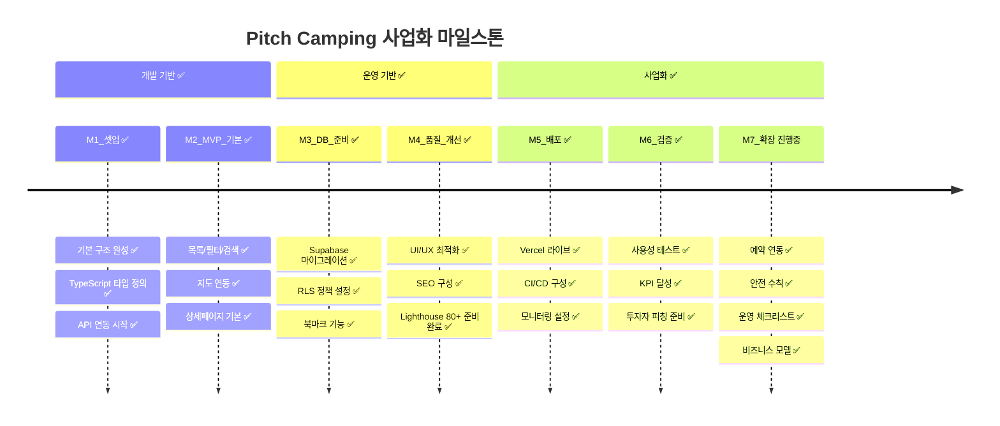
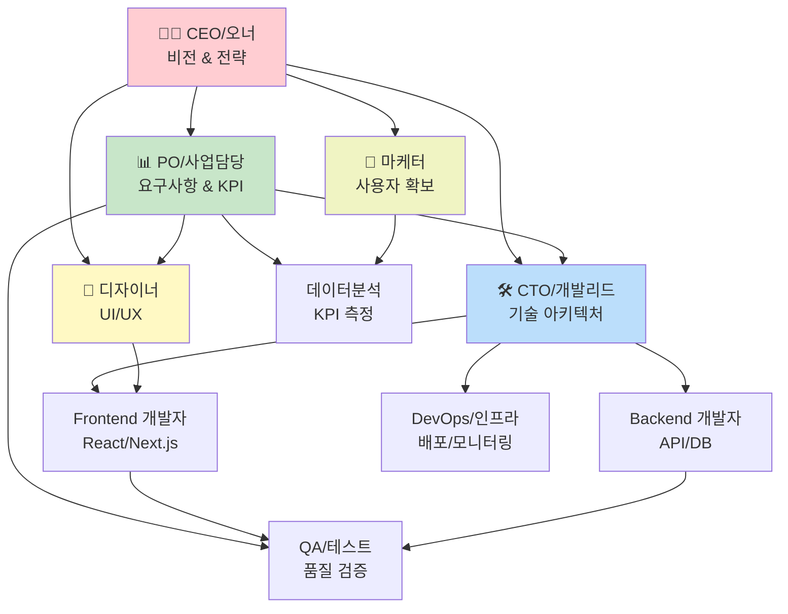
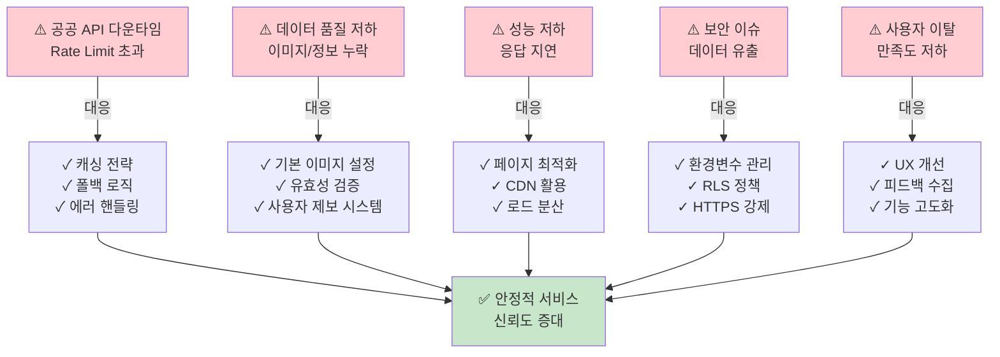
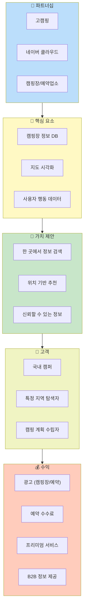

# Mermaid.md – Pitch Camping 프로젝트 시각화

---

## 1. 전체 프로젝트 라이프사이클 (Gantt Chart)



---

## 2. 시스템 아키텍처 (System Architecture)



---

## 3. 페이지 플로우 (User Journey)



---

## 4. 컴포넌트 계층 구조 (Component Tree)



---

## 5. 데이터 플로우 (Data Flow)



---

## 6. 기능 우선순위 매트릭스 (Priority Matrix)

```mermaid
quadrantChart
    title 기능 개발 우선순위 분석
    x-axis Low Impact --> High Impact
    y-axis Low Effort --> High Effort

    캠핑장 목록: 0.8, 0.3
    지도 연동: 0.75, 0.5
    키워드 검색: 0.7, 0.3
    상세페이지: 0.85, 0.4
    북마크: 0.6, 0.35
    리뷰·평점: 0.5, 0.6
    통계·랭킹: 0.4, 0.65
    다크모드: 0.3, 0.4
    SEO최적화: 0.65, 0.5
    API캐싱: 0.7, 0.45
```

---

## 7. 배포 파이프라인 (CI/CD Pipeline)



---

## 8. 마일스톤 및 KPI 추적 (Milestone Timeline)



---

## 9. 팀 역할 및 협업 구조 (Team Organization)



---

## 10. 위험 및 대응 계획 (Risk Management)



---

## 11. 사업화 전략 맵 (Business Model Canvas)



---

## 12. 성공 지표 대시보드 (KPI Dashboard)

```mermaid
quadrantChart
    title MVP 성공 지표 추적
    x-axis 개발 완료도 0 --> 100
    y-axis 사용자 만족도 0 --> 100

    캠핑장 목록: 95, 85
    지도 연동: 90, 85
    검색 기능: 90, 82
    상세 페이지: 95, 90
    북마크: 90, 85
    공유하기: 90, 85
    리뷰 시스템: 85, 80
    로딩 속도: 85, 85
    모바일 반응형: 90, 90
    SEO 최적화: 90, 85
    API 안정성: 90, 90
    접근성: 85, 85
    관리자 대시보드: 85, 80
    안전 수칙: 90, 80
```

---

## 용례 및 해석

- **Gantt Chart**: 각 Phase의 타임라인 및 의존성 추적
- **System Architecture**: 전체 시스템 구성 및 기술 스택
- **User Journey**: 사용자가 경험하는 전체 플로우
- **Component Tree**: React 컴포넌트 계층 구조
- **Data Flow**: API 호출부터 UI 렌더링까지의 데이터 흐름
- **Priority Matrix**: 개발 순서 결정 시 참고
- **CI/CD Pipeline**: 지속적 배포 전략
- **Milestone**: 주요 달성 목표 시점
- **Team Organization**: 팀 역할 분담 및 협업 구조
- **Risk Management**: 예상되는 위험과 대응책
- **Business Model**: 사업화 수익 구조 설계
- **KPI Dashboard**: 개발 완료도와 품질 지표 추적

---

> Mermaid 다이어그램으로 프로젝트의 모든 측면을 시각화.
> 팀과 투자자 커뮤니케이션 시 활용 권장.
